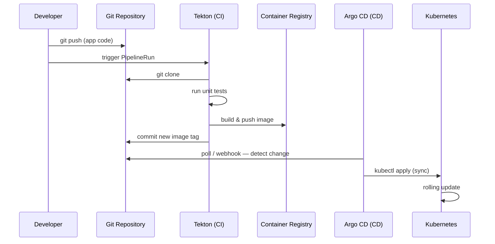

# 02 — Architecture

This lab demonstrates a classic **GitOps** pattern using two CNCF projects:

| Component | Role | Analogy |
|-----------|------|---------|
| **Tekton** | Continuous Integration (CI) | Factory — builds and tests artifacts |
| **Argo CD** | Continuous Delivery (CD) | Thermostat — keeps cluster aligned with Git |
| **Git** | Source of truth | Contract between CI and CD |

## The GitOps loop



## Separation of concerns

### What Tekton does

- Clones source code from Git
- Runs tests
- Builds a container image with Kaniko
- Pushes the image to the minikube registry
- Updates `deploy/overlays/dev/kustomization.yaml` with the new image tag
- Commits and pushes the manifest change to Git

### What Tekton does NOT do

- Does not deploy to the cluster directly
- Does not run `kubectl apply` on application manifests
- Does not modify running pods

### What Argo CD does

- Watches the Git repository continuously
- Compares desired state (Git) vs live state (cluster)
- Applies changes when they diverge
- Reports health and sync status
- Can auto-heal drift (revert manual `kubectl edit` changes)

### What Argo CD does NOT do

- Does not build container images
- Does not run tests
- Does not compile code

## Components in this lab

```
┌─────────────────────────────────────────────────────────────┐
│                        minikube cluster                        │
│                                                              │
│  ┌──────────────┐  ┌──────────────┐  ┌──────────────────┐  │
│  │ tekton-      │  │ argocd       │  │ kube-system      │  │
│  │ pipelines ns │  │ namespace    │  │ (registry addon) │  │
│  └──────────────┘  └──────────────┘  └──────────────────┘  │
│                                                              │
│  ┌──────────────┐  ┌──────────────┐                         │
│  │ polaris-     │  │ polaris-dev  │                         │
│  │ pipeline ns  │  │ namespace    │                         │
│  │ (CI runs)    │  │ (app runs)   │                         │
│  └──────────────┘  └──────────────┘                         │
└─────────────────────────────────────────────────────────────┘
```

## Manifest structure (Kustomize)

```
deploy/
├── base/                  # Shared resources
│   ├── deployment.yaml
│   ├── service.yaml
│   └── kustomization.yaml
└── overlays/
    └── dev/               # Dev-specific overrides
        ├── namespace.yaml
        ├── kustomization.yaml   ← image tag updated by Tekton
        ├── deployment-patch.yaml
        └── service-patch.yaml
```

Argo CD points at `deploy/overlays/dev`. When Tekton bumps the image tag in `kustomization.yaml`, Argo CD picks up the change and redeploys.

## Image registry flow

| Context | Image reference |
|---------|-----------------|
| Host (docker build) | `localhost:5000/polaris-app:v0.1.0` |
| In-cluster (pods, Kaniko) | `registry.kube-system.svc.cluster.local:80/polaris-app:v0.1.0` |

The minikube **registry addon** exposes a registry inside the cluster. Images pushed from the host via `localhost:5000` are available to pods using the in-cluster service URL.

## Why this pattern scales

- **Auditability** — every deployment is a Git commit
- **Rollback** — `git revert` + Argo CD sync
- **Consistency** — same manifests work locally and in production
- **Security** — CI has no direct cluster deploy permissions for prod
- **Review** — manifest changes can go through PR review

## Next

→ [03-minikube-setup.md](03-minikube-setup.md)
